# Gyliardson Keitison | Desarrollador de Software | Full Stack, Automatización e IA Aplicada

  

  <a href="README.md">English</a> · <a href="README.pt-BR.md">Português</a> · <strong>Español</strong> · <a href="README.ja.md">日本語</a>

> Estas traducciones se ofrecen para que el perfil sea más accesible internacionalmente. La disponibilidad de una versión en un idioma determinado no implica competencia profesional en ese idioma.

## Sobre mí

Soy **Desarrollador de Software enfocado en aplicaciones Full Stack, automatización de procesos e IA aplicada**. Desarrollo soluciones de extremo a extremo utilizando **Python, JavaScript/TypeScript, React/Next.js, FastAPI, Node.js, PostgreSQL y Docker**.

Mi trabajo suele estar en la intersección entre la ingeniería de software y la eficiencia operativa: sistemas internos, integraciones corporativas, procesamiento de documentos, RPA, APIs, dashboards, flujos asistidos por IA y soluciones privadas/locales con LLMs.

En el trabajo profesional y en proyectos personales participo en todo el ciclo de entrega, desde arquitectura e implementación hasta pruebas, despliegue, monitoreo, mantenimiento e infraestructura. También utilizo LLMs y coding agents dentro de un flujo de ingeniería estructurado para descomponer tareas, implementar y revisar, con criterios de aceptación, pruebas automatizadas y CI como gates de validación.

  <h3>¿Quieres ver más que el código?</h3>
  
Explora mis proyectos, demos en vivo y conoce más de cerca cómo desarrollo software.

  

## Stack principal

`Python` · `TypeScript` · `JavaScript` · `React` · `Next.js` · `Node.js` · `FastAPI` · `PostgreSQL` · `Supabase` · `Docker` · `GitHub Actions` · `Linux`

**IA aplicada:** RAG · OCR · integración con LLMs · Gemini · Ollama · LangChain

**Desarrollo AI-native:** coding agents · descomposición de tareas · criterios de aceptación · implementación/revisión asistidas · validación con pruebas/CI

## Actividad en GitHub

  
  

Actividad pública en GitHub y distribución de lenguajes en los repositorios. El uso de lenguajes no representa el nivel de dominio.

## Proyectos destacados

### MangaSensei
**Workspace local-first para estudiar japonés con manga**

Aplicación orientada a la privacidad que conserva las páginas originales del manga mientras ejecuta OCR y análisis lingüístico determinista de forma local. La arquitectura incluye lector React, API FastAPI, cola PostgreSQL, workers, autorización basada en capabilities, Sudachi/JMdict, enriquecimiento opcional con Gemini, Docker Compose, pruebas full-stack, CI y límites explícitos de seguridad y privacidad.

`React` · `FastAPI` · `PostgreSQL` · `Docker` · `OCR` · `Sudachi` · `JMdict` · `Gemini`

[**Código fuente**](https://github.com/Gyliardson/mangasensei)

---

### Threadwire
**Controlador local de runtime y tooling para desarrollo**

MVP activo escrito en TypeScript/Node.js 24 que supervisa el runtime legítimo de ChatGPT Classic mediante CDP, con enrutamiento de conversaciones, ejecución serializada de turnos, recuperación de sesión/cold start, streaming conservador, reconciliación de la respuesta final y API HTTP/SSE localhost. Proyecto independiente y no oficial.

`TypeScript` · `Node.js 24` · `CDP` · `HTTP/SSE` · `Pruebas`

[**Código fuente**](https://github.com/Gyliardson/threadwire)

---

### FinanceFlow
**Gestión financiera, automatización y corrección**

Aplicación React Native con backend FastAPI enfocada en la corrección ante reintentos y fallos, combinando PostgreSQL RLS, semántica monetaria decimal exacta, idempotencia durable, almacenamiento privado de recibos, límites explícitos para OCR/IA, reconciliación de resultados ambiguos, CI determinista y una capa independiente de verificación de confianza.

`Python` · `FastAPI` · `React Native` · `PostgreSQL` · `Supabase` · `Gemini` · `Docker`

[**Código fuente**](https://github.com/Gyliardson/FinanceFlow)

---

### StudyFlash AI
**Plataforma de estudio asistida por IA con garantías deterministas**

Plataforma Full Stack con Next.js, FastAPI, PostgreSQL/Prisma, autenticación Clerk, límite server-only para el proveedor de IA, sesiones de estudio reanudables, exámenes con estado autoritativo en el servidor, mutaciones seguras ante reintentos, proveedor de IA determinista para pruebas, Playwright y validación clean-room en CI.

`Next.js` · `FastAPI` · `PostgreSQL` · `Prisma` · `Clerk` · `Groq` · `Playwright`

[**Demo**](https://studyflash-ai.vercel.app/) · [**Código fuente**](https://github.com/Gyliardson/studyflash-ai)

---

### L'Mere Studio
**SaaS Multi-Tenant para Pastelerías**

Plataforma white-label de pedidos con catálogo y administración por tenant, precios y disponibilidad autoritativos en el servidor, verificaciones de ownership, sesiones administrativas revocables, transacciones serializables en PostgreSQL, creación idempotente de pedidos y validación determinista de API/browser.

`Next.js` · `TypeScript` · `React` · `PostgreSQL` · `Prisma` · `Playwright`

[**Demo**](https://lmere-studio.vercel.app) · [**Video**](https://youtu.be/XpgxfHBhJoI) · [**Código fuente**](https://github.com/Gyliardson/lmere-studio)

---

### Little Mere News
**Pipeline determinista de noticias asistido por IA**

Portal bilingüe y CMS en Next.js con ingestión finita de RSS/Atom en Python, validación estructurada de la salida de IA, colas durables, reintentos/cuarentena acotados, idempotencia segura frente a replay, autorización Supabase/PostgreSQL con RLS y CI determinista.

`Next.js` · `Python` · `Supabase` · `PostgreSQL` · `IA compatible con Ollama` · `GitHub Actions`

[**Demo**](https://little-mere-news.onrender.com/en) · [**Código fuente**](https://github.com/Gyliardson/little-mere-news)

---

### Smart Feedback API
**Clasificación de tickets con IA — Prototipo**

Prototipo REST para clasificación automática de tickets de soporte, con análisis de sentimiento, categorización, priorización, salida JSON estructurada y ejecución local de LLM.

`Python` · `FastAPI` · `Docker` · `Ollama` · `Pydantic`

[**Código fuente**](https://github.com/Gyliardson/smart-feedback-api)

---

### Local RAG Assistant
**Asistente offline para documentos — Prototipo**

Prototipo local para analizar PDFs de forma privada con chunking, embeddings, recuperación vectorial, respuestas con referencias a las fuentes e inferencia mediante LLM local.

`Python` · `LangChain` · `Streamlit` · `ChromaDB` · `Ollama`

[**Código fuente**](https://github.com/Gyliardson/local-rag-assistant)

## Lo que me gusta construir

- Automatización de procesos y RPA
- Sistemas internos y dashboards B2B
- APIs REST e integraciones corporativas
- Backends confiables y arquitecturas orientadas a la corrección
- Ingestión de documentos, OCR, búsqueda semántica y RAG
- Soluciones de IA local-first y privadas
- Tooling y flujos de ingeniería asistidos por IA
- Servicios con Docker, CI/CD e infraestructura pragmática

## Contacto

  <a href="https://linkedin.com/in/gyliardson-keitison">LinkedIn</a> ·
  <a href="https://portfolio.gyli.dev/">Portfolio</a> ·
  <a href="mailto:gyliardson@outlook.com">Email</a>

