# Gyliardson Keitison | ソフトウェア開発 | Full Stack・自動化・応用AI

  

  <a href="README.md">English</a> · <a href="README.pt-BR.md">Português</a> · <a href="README.es.md">Español</a> · <strong>日本語</strong>

> この翻訳版は、海外の方にもプロフィールを読みやすくするために用意しています。各言語版が存在することは、その言語を業務レベルで話せることを意味しません。

## 自己紹介

私は、**Full Stack アプリケーション、業務プロセス自動化、応用AIを中心に取り組むソフトウェア開発者**です。主に **Python、JavaScript/TypeScript、React/Next.js、FastAPI、Node.js、PostgreSQL、Docker** を使い、設計から運用まで一貫したソリューションを開発しています。

業務では、ソフトウェアエンジニアリングと業務効率化の接点にある課題を扱うことが多く、社内システム、企業向け連携、文書処理、RPA、API、ダッシュボード、AI支援ワークフロー、ローカル／プライベート環境でのLLM活用などに取り組んでいます。

実務と個人プロジェクトの両方で、アーキテクチャ設計・実装からテスト、デプロイ、監視、保守、インフラまで開発ライフサイクル全体に関わっています。また、LLMやcoding agentを、タスク分解・実装・レビューのための構造化されたエンジニアリングフローの一部として利用し、受け入れ条件、自動テスト、CIを検証ゲートとして扱っています。

  <h3>コード以外も見てみませんか？</h3>
  
プロジェクトやライブデモを通して、私がどのようにソフトウェアを開発しているかご覧いただけます。

  

## 主な技術スタック

`Python` · `TypeScript` · `JavaScript` · `React` · `Next.js` · `Node.js` · `FastAPI` · `PostgreSQL` · `Supabase` · `Docker` · `GitHub Actions` · `Linux`

**応用AI:** RAG · OCR · LLM連携 · Gemini · Ollama · LangChain

**AI-native開発:** coding agent · タスク分解 · 受け入れ条件 · 実装／レビュー支援 · テスト／CIによる検証

## GitHubでの活動

  
  

公開されているGitHub上の活動と、リポジトリ内の言語構成を表示しています。言語の使用量は習熟度を示すものではありません。

## 主なプロジェクト

### MangaSensei
**ローカルファーストの日本語マンガ学習ワークスペース**

元のマンガ画像を保持したまま、OCRと決定論的な言語解析をローカルで実行する、プライバシー重視の読書・学習アプリです。React製リーダー、FastAPI、PostgreSQLキュー、ワーカー処理、capabilityベースの認可、Sudachi/JMdict、任意のGemini連携、Docker Compose、Full Stackテスト、CI、明示的なセキュリティ／プライバシー境界を備えています。

`React` · `FastAPI` · `PostgreSQL` · `Docker` · `OCR` · `Sudachi` · `JMdict` · `Gemini`

[**ソースコード**](https://github.com/Gyliardson/mangasensei)

---

### Threadwire
**ローカルRuntime Controller & 開発Tooling**

TypeScript/Node.js 24で実装している開発中のMVPです。正規のChatGPT Classic runtimeをCDP経由で監督し、会話ルーティング、turnの直列実行、session／cold start recovery、保守的なresponse streaming、最終応答のreconciliation、localhost HTTP/SSE APIを提供します。独立した非公式プロジェクトです。

`TypeScript` · `Node.js 24` · `CDP` · `HTTP/SSE` · `Testing`

[**ソースコード**](https://github.com/Gyliardson/threadwire)

---

### FinanceFlow
**財務管理・自動化・正確性**

React NativeとFastAPIで構成した財務アプリで、retryや障害時の正確性を重視しています。PostgreSQL RLS、正確なdecimal金額処理、永続的idempotency、非公開の領収書storage、OCR/AI境界、曖昧な結果のreconciliation、決定論的CI、独立したtrust verificationレイヤーを備えています。

`Python` · `FastAPI` · `React Native` · `PostgreSQL` · `Supabase` · `Gemini` · `Docker`

[**ソースコード**](https://github.com/Gyliardson/FinanceFlow)

---

### StudyFlash AI
**決定論的な保証を備えたAI支援学習プラットフォーム**

Next.js、FastAPI、PostgreSQL/Prisma、Clerk認証で構成したFull Stack学習プラットフォームです。server-onlyのAI provider境界、再開可能な学習session、server-authoritativeな試験、retry-safeなmutation、テスト用の決定論的AI provider、Playwright、clean-room CI検証を備えています。

`Next.js` · `FastAPI` · `PostgreSQL` · `Prisma` · `Clerk` · `Groq` · `Playwright`

[**デモ**](https://studyflash-ai.vercel.app/) · [**ソースコード**](https://github.com/Gyliardson/studyflash-ai)

---

### L'Mere Studio
**製菓店向けマルチテナントSaaS**

tenant単位のcatalog／管理機能、server-authoritativeな価格・在庫可用性、ownership検証、失効可能な管理session、PostgreSQL serializable transaction、idempotentな注文作成、決定論的なAPI／browser検証を備えたwhite-label注文プラットフォームです。

`Next.js` · `TypeScript` · `React` · `PostgreSQL` · `Prisma` · `Playwright`

[**デモ**](https://lmere-studio.vercel.app) · [**動画**](https://youtu.be/XpgxfHBhJoI) · [**ソースコード**](https://github.com/Gyliardson/lmere-studio)

---

### Little Mere News
**決定論的なAI支援テクノロジーニュースパイプライン**

Next.jsのバイリンガルportal／CMSと、Pythonによる有限RSS/Atom ingestionを組み合わせたシステムです。構造化AI出力の検証、永続queue、bounded retry／quarantine、replay-safe idempotency、Supabase/PostgreSQL認可とRLS、決定論的CIを備えています。

`Next.js` · `Python` · `Supabase` · `PostgreSQL` · `Ollama-compatible AI` · `GitHub Actions`

[**デモ**](https://little-mere-news.onrender.com/en) · [**ソースコード**](https://github.com/Gyliardson/little-mere-news)

---

### Smart Feedback API
**AIによるサポートチケット分類API — プロトタイプ**

サポートチケットの感情分析、カテゴリ分類、優先度判定、構造化JSON出力、ローカルLLM実行を行うRESTプロトタイプです。

`Python` · `FastAPI` · `Docker` · `Ollama` · `Pydantic`

[**ソースコード**](https://github.com/Gyliardson/smart-feedback-api)

---

### Local RAG Assistant
**オフライン文書アシスタント — プロトタイプ**

PDFをローカル環境でプライベートに分析するプロトタイプです。チャンク分割、Embedding、ベクトル検索、参照元付き回答、ローカルLLM推論を実装しています。

`Python` · `LangChain` · `Streamlit` · `ChromaDB` · `Ollama`

[**ソースコード**](https://github.com/Gyliardson/local-rag-assistant)

## 得意・関心のある領域

- 業務プロセス自動化・RPA
- 社内システム・B2Bダッシュボード
- REST API・企業向けシステム連携
- 信頼性の高いbackendとcorrectness重視のarchitecture
- 文書取り込み、OCR、セマンティック検索、RAG
- ローカルファースト／プライベートAI
- AI支援developer toolingとengineering workflow
- Docker、CI/CD、実用重視のインフラ構成

## 連絡先

  <a href="https://linkedin.com/in/gyliardson-keitison">LinkedIn</a> ·
  <a href="https://portfolio.gyli.dev/">Portfolio</a> ·
  <a href="mailto:gyliardson@outlook.com">Email</a>

