# Gyliardson Keitison | Software Developer | Full Stack, Automation & Applied AI

  

  <strong>English</strong> · <a href="README.pt-BR.md">Português</a> · <a href="README.es.md">Español</a> · <a href="README.ja.md">日本語</a>

> These translations are provided to make the profile easier to read internationally. Language availability here does not imply professional proficiency in each language.

## About me

I am a **Software Developer focused on Full Stack applications, process automation, and Applied AI**. I build end-to-end solutions using **Python, JavaScript/TypeScript, React/Next.js, FastAPI, Node.js, PostgreSQL, and Docker**.

My work usually sits at the intersection of software engineering and operational efficiency: internal systems, corporate integrations, document processing, RPA, APIs, dashboards, AI-assisted workflows, and local/private LLM solutions.

Across professional work and personal projects, I operate through the complete delivery lifecycle, from architecture and implementation to testing, deployment, monitoring, maintenance, and infrastructure. I also use LLMs and coding agents as part of a structured engineering workflow for task decomposition, implementation, and review, with acceptance criteria, automated tests, and CI acting as validation gates.

  <h3>Want to see more than the code?</h3>
  
Explore my projects, live demos and a closer look at how I build software.

  

## Main stack

`Python` · `TypeScript` · `JavaScript` · `React` · `Next.js` · `Node.js` · `FastAPI` · `PostgreSQL` · `Supabase` · `Docker` · `GitHub Actions` · `Linux`

**Applied AI:** RAG · OCR · LLM integrations · Gemini · Ollama · LangChain

**AI-native development:** coding agents · task decomposition · acceptance criteria · implementation/review assistance · test/CI validation

## GitHub Activity

  
  

Public GitHub activity and repository language distribution. Language usage is not a measure of proficiency.

## Highlighted projects

### MangaSensei
**Local-first Japanese manga study workspace**

A privacy-oriented reading and language-study application that preserves original manga pages while running OCR and deterministic linguistic analysis locally. The architecture includes a React reader, FastAPI API, PostgreSQL queue, worker processing, capability-based authorization, Sudachi/JMdict integration, optional Gemini enrichment, Docker Compose, full-stack tests, CI, and explicit privacy/security boundaries.

`React` · `FastAPI` · `PostgreSQL` · `Docker` · `OCR` · `Sudachi` · `JMdict` · `Gemini`

[**Source Code**](https://github.com/Gyliardson/mangasensei)

---

### Threadwire
**Local Runtime Controller & Developer Tooling**

Active MVP local controller written in TypeScript/Node.js 24 that supervises the legitimate ChatGPT Classic runtime through CDP, with conversation routing, serialized turn execution, session/cold-start recovery, conservative response streaming, final-response reconciliation, and a localhost HTTP/SSE API. Independent and unofficial project.

`TypeScript` · `Node.js 24` · `CDP` · `HTTP/SSE` · `Testing`

[**Source Code**](https://github.com/Gyliardson/threadwire)

---

### FinanceFlow
**Financial Management, Automation & Correctness**

React Native application with a FastAPI backend focused on correctness under retries and failure, combining PostgreSQL RLS, exact decimal money semantics, durable idempotency, private receipt storage, OCR/AI boundaries, ambiguous-outcome reconciliation, deterministic CI, and an independent trust-verification layer.

`Python` · `FastAPI` · `React Native` · `PostgreSQL` · `Supabase` · `Gemini` · `Docker`

[**Source Code**](https://github.com/Gyliardson/FinanceFlow)

---

### StudyFlash AI
**AI-Assisted Study Platform with Deterministic Guarantees**

Full Stack study platform with Next.js, FastAPI, PostgreSQL/Prisma, Clerk authentication, server-only AI provider boundaries, resumable study sessions, server-authoritative exams, retry-safe mutations, deterministic AI test providers, Playwright coverage, and clean-room CI validation.

`Next.js` · `FastAPI` · `PostgreSQL` · `Prisma` · `Clerk` · `Groq` · `Playwright`

[**Live Demo**](https://studyflash-ai.vercel.app/) · [**Source Code**](https://github.com/Gyliardson/studyflash-ai)

---

### L'Mere Studio
**Multi-Tenant SaaS for Bakeries**

White-label ordering platform with tenant-scoped catalog and administration, server-authoritative pricing and availability, ownership checks, revocable admin sessions, serializable PostgreSQL transactions, idempotent order creation, and deterministic API/browser validation.

`Next.js` · `TypeScript` · `React` · `PostgreSQL` · `Prisma` · `Playwright`

[**Live Demo**](https://lmere-studio.vercel.app) · [**Demo Video**](https://youtu.be/XpgxfHBhJoI) · [**Source Code**](https://github.com/Gyliardson/lmere-studio)

---

### Little Mere News
**Deterministic AI-Assisted Technology News Pipeline**

Bilingual Next.js portal and CMS backed by finite Python RSS/Atom ingestion, structured AI-output validation, durable queues, bounded retry/quarantine behavior, replay-safe idempotency, Supabase/PostgreSQL authorization with RLS, and deterministic CI.

`Next.js` · `Python` · `Supabase` · `PostgreSQL` · `Ollama-compatible AI` · `GitHub Actions`

[**Live Demo**](https://little-mere-news.onrender.com/en) · [**Source Code**](https://github.com/Gyliardson/little-mere-news)

---

### Smart Feedback API
**AI Ticket Classification API — Prototype**

REST prototype for automated support-ticket triage, including sentiment analysis, categorization, prioritization, structured JSON output, and local LLM execution.

`Python` · `FastAPI` · `Docker` · `Ollama` · `Pydantic`

[**Source Code**](https://github.com/Gyliardson/smart-feedback-api)

---

### Local RAG Assistant
**Offline Document Assistant — Prototype**

Local prototype for private PDF analysis with chunking, embeddings, vector retrieval, source-aware answers, and local LLM inference.

`Python` · `LangChain` · `Streamlit` · `ChromaDB` · `Ollama`

[**Source Code**](https://github.com/Gyliardson/local-rag-assistant)

## What I like building

- Business process automation and RPA
- Internal systems and B2B dashboards
- REST APIs and corporate integrations
- Reliable backend systems and correctness-oriented architectures
- Document ingestion, OCR, semantic search, and RAG
- Local-first/private AI solutions
- AI-assisted developer tooling and engineering workflows
- Dockerized services, CI/CD, and pragmatic infrastructure

## Contact

  <a href="https://linkedin.com/in/gyliardson-keitison">LinkedIn</a> ·
  <a href="https://portfolio.gyli.dev/">Portfolio</a> ·
  <a href="mailto:gyliardson@outlook.com">Email</a>

