# Gyliardson Keitison | Desenvolvedor de Software | Full Stack, Automação & IA Aplicada

  

  <a href="README.md">English</a> · <strong>Português</strong> · <a href="README.es.md">Español</a> · <a href="README.ja.md">日本語</a>

> Estas traduções existem para tornar o perfil mais acessível internacionalmente. A disponibilidade de uma versão em determinado idioma não representa proficiência profissional nesse idioma.

## Sobre mim

Sou **Desenvolvedor de Software com foco em aplicações Full Stack, automação de processos e IA Aplicada**. Desenvolvo soluções ponta a ponta utilizando **Python, JavaScript/TypeScript, React/Next.js, FastAPI, Node.js, PostgreSQL e Docker**.

Meu trabalho costuma ficar na interseção entre engenharia de software e eficiência operacional: sistemas internos, integrações corporativas, processamento de documentos, RPA, APIs, dashboards, fluxos assistidos por IA e soluções com LLMs locais e privados.

Em experiências profissionais e projetos pessoais, atuo em todo o ciclo de entrega, desde arquitetura e implementação até testes, deploy, monitoramento, manutenção e infraestrutura. Também utilizo LLMs e coding agents em um fluxo estruturado de engenharia para decomposição de tarefas, implementação e revisão, com critérios de aceite, testes automatizados e CI funcionando como gates de validação.

  <h3>Quer ver mais do que o código?</h3>
  
Explore meus projetos, demos ao vivo e veja mais de perto como eu desenvolvo software.

  

## Stack principal

`Python` · `TypeScript` · `JavaScript` · `React` · `Next.js` · `Node.js` · `FastAPI` · `PostgreSQL` · `Supabase` · `Docker` · `GitHub Actions` · `Linux`

**IA Aplicada:** RAG · OCR · integração com LLMs · Gemini · Ollama · LangChain

**Desenvolvimento AI-native:** coding agents · decomposição de tarefas · critérios de aceite · implementação/revisão assistidas · validação por testes/CI

## Atividade no GitHub

  
  

Atividade pública no GitHub e distribuição de linguagens nos repositórios. O uso de linguagens não representa nível de proficiência.

## Projetos em destaque

### MangaSensei
**Workspace local-first para estudo de japonês com mangás**

Aplicação orientada à privacidade que preserva as páginas originais do mangá enquanto executa OCR e análise linguística determinística localmente. A arquitetura inclui leitor em React, API FastAPI, fila PostgreSQL, workers, autorização baseada em capabilities, Sudachi/JMdict, enriquecimento opcional com Gemini, Docker Compose, testes full-stack, CI e fronteiras explícitas de segurança e privacidade.

`React` · `FastAPI` · `PostgreSQL` · `Docker` · `OCR` · `Sudachi` · `JMdict` · `Gemini`

[**Código-fonte**](https://github.com/Gyliardson/mangasensei)

---

### Threadwire
**Controlador local de runtime & tooling para desenvolvimento**

MVP ativo escrito em TypeScript/Node.js 24 que supervisiona o runtime legítimo do ChatGPT Classic via CDP, com roteamento de conversas, execução serializada de turnos, recuperação de sessão/cold start, streaming conservador, reconciliação da resposta final e API HTTP/SSE localhost. Projeto independente e não oficial.

`TypeScript` · `Node.js 24` · `CDP` · `HTTP/SSE` · `Testes`

[**Código-fonte**](https://github.com/Gyliardson/threadwire)

---

### FinanceFlow
**Gestão financeira, automação & correção de dados**

Aplicativo React Native com backend FastAPI focado em correção sob retries e falhas, combinando PostgreSQL RLS, semântica monetária decimal exata, idempotência durável, armazenamento privado de comprovantes, fronteiras de OCR/IA, reconciliação de resultados ambíguos, CI determinístico e uma camada independente de verificação de confiança.

`Python` · `FastAPI` · `React Native` · `PostgreSQL` · `Supabase` · `Gemini` · `Docker`

[**Código-fonte**](https://github.com/Gyliardson/FinanceFlow)

---

### StudyFlash AI
**Plataforma de estudo assistida por IA com garantias determinísticas**

Plataforma Full Stack com Next.js, FastAPI, PostgreSQL/Prisma, autenticação Clerk, fronteira server-only para o provedor de IA, sessões de estudo retomáveis, provas com estado autoritativo no servidor, mutações seguras sob retry, provider de IA determinístico para testes, Playwright e validação clean-room em CI.

`Next.js` · `FastAPI` · `PostgreSQL` · `Prisma` · `Clerk` · `Groq` · `Playwright`

[**Demo**](https://studyflash-ai.vercel.app/) · [**Código-fonte**](https://github.com/Gyliardson/studyflash-ai)

---

### L'Mere Studio
**SaaS Multi-Tenant para Confeitarias**

Plataforma white-label de pedidos com catálogo e administração por tenant, preços e disponibilidade autoritativos no servidor, verificações de ownership, sessões administrativas revogáveis, transações PostgreSQL serializáveis, criação idempotente de pedidos e validação determinística de API/browser.

`Next.js` · `TypeScript` · `React` · `PostgreSQL` · `Prisma` · `Playwright`

[**Demo**](https://lmere-studio.vercel.app) · [**Vídeo**](https://youtu.be/XpgxfHBhJoI) · [**Código-fonte**](https://github.com/Gyliardson/lmere-studio)

---

### Little Mere News
**Pipeline determinístico de notícias com IA assistiva**

Portal bilíngue e CMS em Next.js com ingestão finita de RSS/Atom em Python, validação estruturada da saída de IA, filas duráveis, retry/quarentena limitados, idempotência segura contra replay, autorização Supabase/PostgreSQL com RLS e CI determinístico.

`Next.js` · `Python` · `Supabase` · `PostgreSQL` · `IA compatível com Ollama` · `GitHub Actions`

[**Demo**](https://little-mere-news.onrender.com/en) · [**Código-fonte**](https://github.com/Gyliardson/little-mere-news)

---

### Smart Feedback API
**Classificação de chamados com IA — Protótipo**

Protótipo REST para triagem automática de tickets de suporte, com análise de sentimento, categorização, priorização, saída JSON estruturada e execução de LLM local.

`Python` · `FastAPI` · `Docker` · `Ollama` · `Pydantic`

[**Código-fonte**](https://github.com/Gyliardson/smart-feedback-api)

---

### Local RAG Assistant
**Assistente offline para documentos — Protótipo**

Protótipo local para análise privada de PDFs com chunking, embeddings, recuperação vetorial, respostas com referência às fontes e inferência por LLM local.

`Python` · `LangChain` · `Streamlit` · `ChromaDB` · `Ollama`

[**Código-fonte**](https://github.com/Gyliardson/local-rag-assistant)

## O que gosto de construir

- Automação de processos e RPA
- Sistemas internos e dashboards B2B
- APIs REST e integrações corporativas
- Backends confiáveis e arquiteturas orientadas à correção
- Ingestão de documentos, OCR, busca semântica e RAG
- Soluções de IA local-first e privadas
- Tooling e workflows de engenharia assistidos por IA
- Serviços em Docker, CI/CD e infraestrutura pragmática

## Contato

  <a href="https://linkedin.com/in/gyliardson-keitison">LinkedIn</a> ·
  <a href="https://portfolio.gyli.dev/">Portfólio</a> ·
  <a href="mailto:gyliardson@outlook.com">Email</a>

